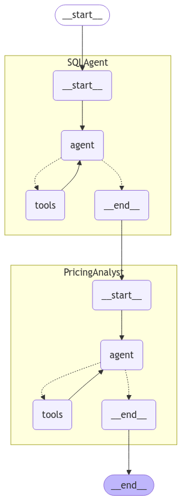

# Pricing Elasticity with Agentic workflow

This documentation describes the technical aspects of the Pricing Elasticity Project. The project focuses on calculating price elasticity based on historical order data and providing pricing insights using a multi-agent system built with LangGraph. This document covers the elasticity equation and explains the agent flow.

---

## Elasticity Equation

Price elasticity is measured using a log-log linear regression model. The model is expressed mathematically as:

$$
\ln(Q) = \alpha + \beta \ln(P) + \epsilon
$$

Where:  
- \( $ Q \ $) is the quantity demanded.  
- \( $ P \ $) is the price (which may be the regular price or sale price).  
- \( $ \alpha \ $) is the intercept term.  
- \( $ \beta \ $) is the elasticity coefficient, representing the percentage change in quantity for a 1% change in price.  
- \( $ \epsilon \ $) is the error term.

The absolute value of \( $ \beta \ $) is used to report elasticity magnitude.

---

## LangGraph Agent Flow

The system employs a two-agent architecture to answer user questions about pricing strategies. The agents work together to combine database query results with expert pricing analysis.

### Agent Descriptions

- **SQLAgent:**  
  - **Role:** Interacts with the SQLite database using a SQL toolkit.
  - **Function:** Given a user's question, it generates a syntactically correct SQLite query based on the available tables (orders, products, and computed elasticity tables) and returns a concise summary of the query results.
  
- **PricingAnalystAgent:**  
  - **Role:** Acts as an expert in pricing analysis and strategy.
  - **Function:** It takes the original user question along with the output from the SQLAgent and provides a final answer with detailed pricing insights and recommendations.

### Agent Workflow

The overall flow is orchestrated using LangGraph. The state graph defines the following sequence:
1. **Start:** The process begins with the user’s question.
2. **SQLAgent Node:** The SQLAgent generates and executes a query to retrieve relevant data from the database. Its output is stored in the state as `sql_output`.
3. **PricingAnalyst Node:** The PricingAnalystAgent receives the original question and the SQLAgent’s output and generates a final answer with pricing analysis.
4. **End:** The final answer is returned as the unified output.

Below is a visual representation of the state graph:

This diagram illustrates the flow from the initial question through the SQLAgent and finally the PricingAnalystAgent, resulting in a final answer.

---

## Summary

- The project calculates price elasticity using the log-log regression model.
- A multi-agent system built with LangGraph handles the process:
  - The **SQLAgent** queries the database for relevant information.
  - The **PricingAnalystAgent** synthesizes the query output and the original question to produce actionable pricing insights.
- The system leverages a state graph to coordinate agent interaction, ensuring a seamless flow from data extraction to expert analysis.

For further details on the implementation and configuration of each component, please refer to the source code and supplementary documentation.
